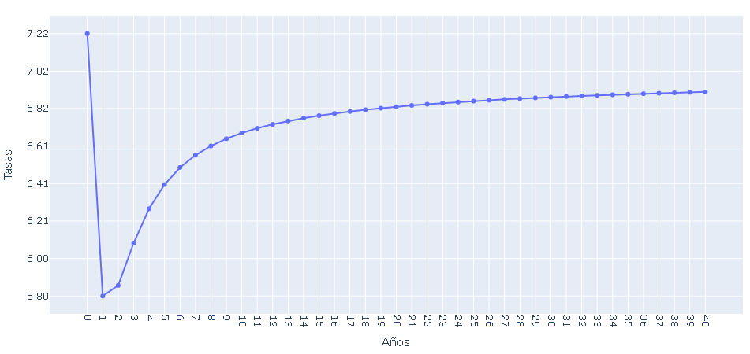

sbs-gob-pe-helper
==============================

Nota : Te recomendamos revisar la [Nota legal](docs/NotaLegal.md) antes de emplear la libreria.


**sbs-gob-pe-helper** ofrece una forma Pythonica de descargar datos de mercado de la [Superintendencia de Banca y Seguros del Perú](https://www.sbs.gob.pe/), mediante web scraping.


---

## Instalación

Instala `sbs-gob-pe-helper` usando `pip`:

``` {.sourceCode .bash}
$ pip install sbs-gob-pe-helper
```

---

## Quick Start

### El modulo CuponCero 

El módulo `CuponCero` permite acceder a los datos de bonos cupón cero de la SBS de una manera más alineada a Python:

```python
import sbs_gob_pe_helper.CuponCero as cc

tp_curva = 'CCPSS'
fec_proceso = '31/07/2023'

#obtiene todos los datos de la curva de cupon cero de un determinado fecha de proceso
df_cup= cc.get_curva_cupon_cero(tipoCurva=tp_curva, fechaProceso=fec_proceso)
```

Si quieres obtener la frafica de la curva cupon cero, entonces:

```python
cc.plot_curva(df_cup)
```




Para extrapolar tasas de interes de forma lineal entonces realizar esto:


```python
data = {
    "dias": [0, 30, 60 , 90 , 120],    
}

df_test = pd.DataFrame(data)


df_test['tasas'] = df_test['dias'].apply(cc.get_tasa_interes_por_dias, args=(df_cup,))

```

### El modulo VectorPrecioRentaFija 

El módulo `VectorPrecioRentaFija` permite acceder a los datos de bonos cupón cero de la SBS de una manera más alineada a Python:

```python

import sbs_gob_pe_helper.VectorPrecioRentaFija as vp 

fechaProceso = '21/07/2023'

#Obtiene el vector de precios de instrumentos de renta fija disponibles en la SBS para una fecha de proceso específica:
df_vector = vp.get_vector_precios(fechaProceso=fechaProceso)

df_vector.columns.tolist()
```

```json

['Nemónico',
 'ISIN/Identif.',
 'Emisor',
 'Moneda',
 'P. Limpio (%)',
 'TIR %',
 'Origen(*)',
 'Spreads',
 'P. Limpio (monto)',
 'P. Sucio (monto)',
 'I.C. (monto)',
 'F. Emisión',
 'F. Vencimiento',
 'Cupón (%)',
 'Margen Libor (%)',
 'TIR % S/Opc',
 'Rating Emisión',
 'Ult. Cupón',
 'Prox. Cupón',
 'Duración',
 'Var  PLimpio',
 'Var PSucio',
 'Var Tir']
```

```python

#Exhibiendo los primeros 5 registros del vector de precios:
df_vector.head()
```


---

## Documentación

### sbs_gob_pe_helper.VectorPrecioRentaFija


| Parametro | Descripción |
| ------ | ------ |
|fechaProceso| Fecha de procesamiento|
|cboEmisor| Emisor|
|cboMoneda| Tipo de Moneda|
|cboRating| Rating Emisión|


#### cboEmisor
Si no se asigna un valor, entonces el filtro no se aplicará.

| cboEmisor | Descripciòn |
| ------ | ------ |
|1000| GOB.CENTRAL|
|2011| ALICORP S.A.|
|0087| BANCO FALABELLA|
|0088| BCO RIPLEY|
|0001| BCRP|
|0011| CONTINENTAL|
|0042| CREDISCOTIA|
|0003| INTERBANK|

Los emisores disponibles se encuentran en la siguiente página: https://www.sbs.gob.pe/app/pu/CCID/Paginas/vp_rentafija.aspx

#### cboMoneda
Si no se asigna un valor, entonces el filtro no se aplicará.

| cboMoneda | Descripciòn |
| ------ | ------ |
| 1 |   Soles|
| 2 | Soles VAC|
| 3 | Dolares|


#### cboRating
Si no se asigna un valor, entonces el filtro no se aplicará.

| cboRating | 
| ------ | 
|A|
|A+|
|A-|
|AA|
|AA+|
|AA-|
|AAA|
|B-|
|BB|
|CP-1|
|CP-1+|
|CP-1-|
|CP-2|
|CP-2+|
